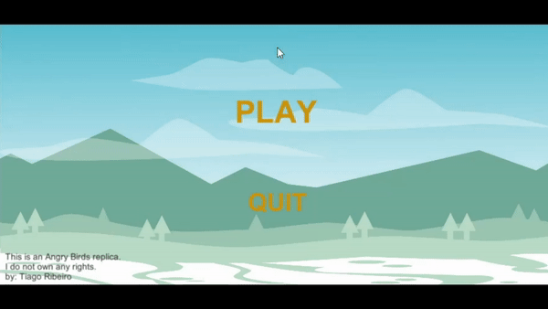
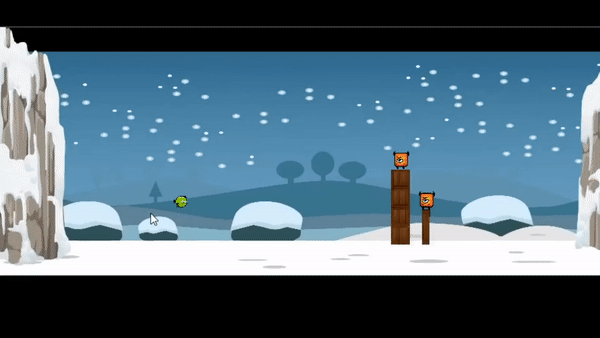
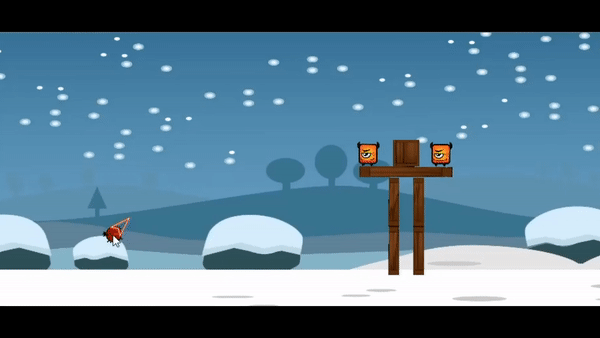
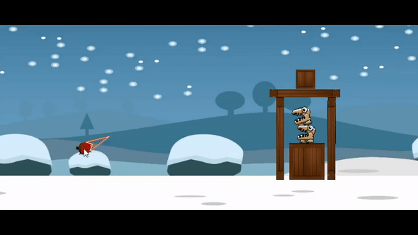
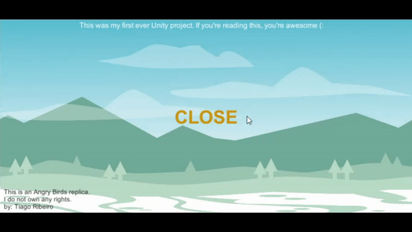

---------------------------------

#### My very first Unity project!

* An extremely simple four level game of Angry Birds replica.
* I don't own any of the art used in this project.
* Every pack used is from free sources.
* All authors of every single art pack are identified below.

----------------------------------

----------------------------------

----------------------------------

----------------------------------

----------------------------------

----------------------------------

----------------------------------

##### Art

Background, Green Bird and Enemy NPC's by: Bevouliin
Please visit (www.bevouliin.com) to check his work.

Box 2D art by: Alucard
Please visit (www.opengameart.org/users/alucard) to check his work.

Mountain Art by: Bart Kelsey
Please visit (www.opengameart.org/users/bart) to check his work.

Flame Animation by: Cem Kalyoncu
Please visit (www.opengameart.org/users/cemkalyoncu) to check his work.

